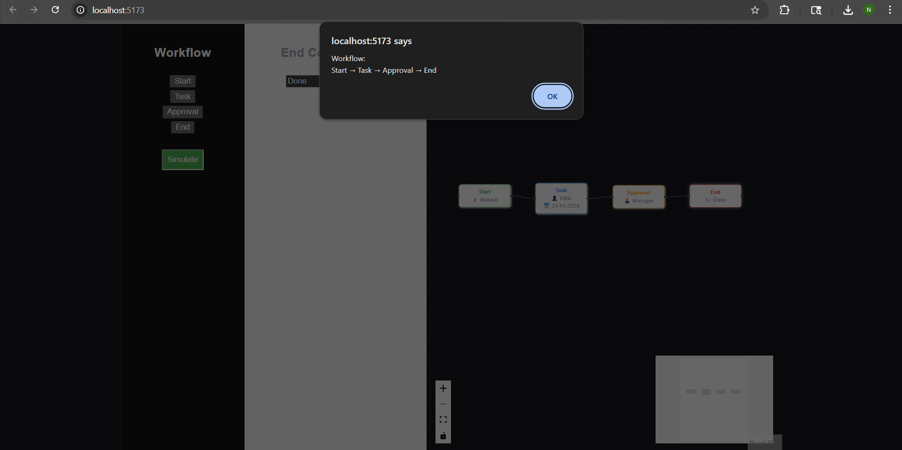

# 🚀 HR Workflow Designer

## 📌 Overview

The **HR Workflow Designer** is a visual workflow builder that allows users to create, connect, configure, and simulate HR processes such as onboarding, approvals, and task assignments.

It provides an interactive drag-and-drop interface where workflows can be designed dynamically and validated before execution.

---

## ✨ Features

* 🔹 Create nodes: **Start, Task, Approval, End**
* 🔹 Drag-and-drop workflow builder (React Flow)
* 🔹 Connect nodes visually
* 🔹 Dynamic configuration panel for each node type
* 🔹 Multi-line node display (assignee, date, message)
* 🔹 Workflow validation (ensures proper connections)
* 🔹 Workflow simulation preview
* 🔹 Clean and responsive UI

---

## 🛠 Tech Stack

* **Frontend:** React (Vite)
* **Library:** React Flow
* **Language:** JavaScript
* **Styling:** CSS

---

## 🖼 Preview

### Workflow Canvas


### Simulation View



---

## ▶️ How to Run

1. Clone the repository
2. Install dependencies:

   ```
   npm install
   ```
3. Start the development server:

   ```
   npm run dev
   ```
4. Open in browser:

   ```
   http://localhost:5173
   ```

---

## 🔄 Sample Workflow

Start → Task → Approval → End

---

## 📂 Project Structure

```
src/
 ├── App.jsx
 ├── main.jsx
 ├── App.css
 ├── index.css
public/
index.html
```

---

## 👩‍💻 Author

**Nikitha Gaddam**

---

## ⭐ Notes

* Ensure Node.js is installed before running
* This project is built for demonstrating workflow visualization and simulation logic
* Can be extended with backend integration for real-world use

---
