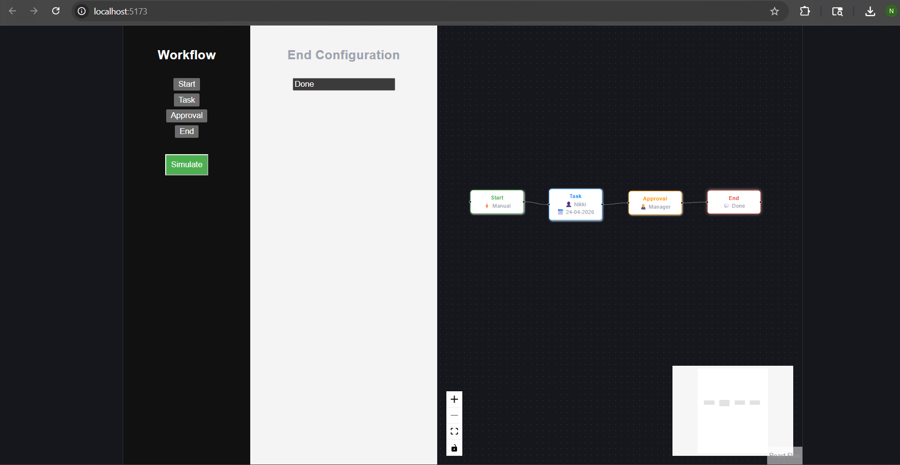

# HR Workflow Designer

## Overview

A visual workflow builder that allows users to create, connect, configure, and simulate HR workflows like onboarding and approvals.

## Features

* Create nodes: Start, Task, Approval, End
* Connect nodes visually
* Edit node details (assignee, date, message)
* Simulate workflow

## Tech Stack

* React (Vite)
* React Flow
* JavaScript

## Preview

### Workflow Canvas

### Simulation View

## How to Run

1. Clone the repository
2. Run:
   npm install
3. Start:
   npm run dev
4. Open:
   http://localhost:5173

## Sample Flow

Start → Task → Approval → End

## Author

Nikitha Gaddam

